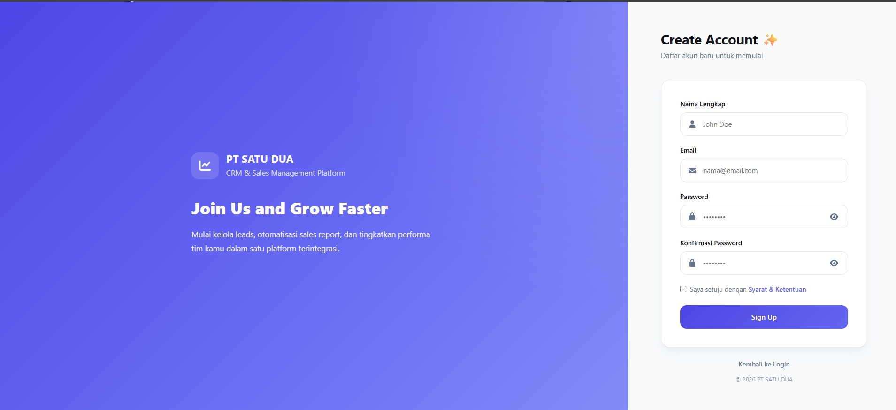
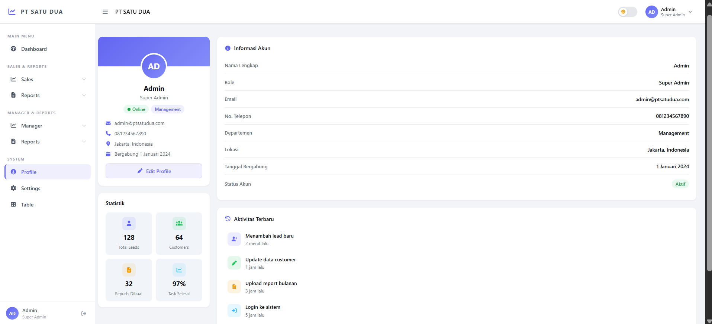
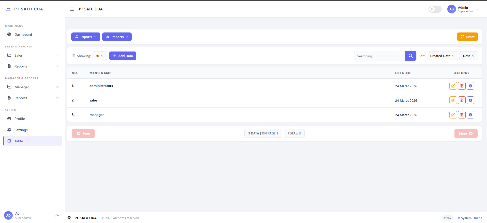
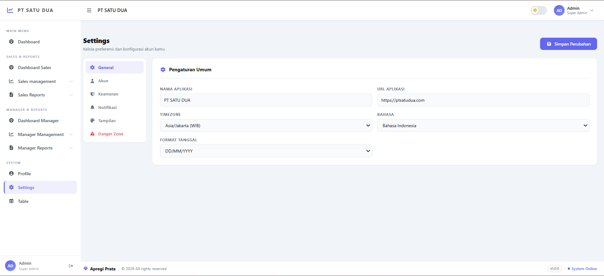

# TEMPLATE-VUE

Modern Open Source Vue 3 Admin Template built with CoreUI + Vite.


---

## ✨ Overview

TEMPLATE-VUE is a reusable and scalable admin dashboard starter template built using:

- Vue 3
- Vite
- CoreUI
- Pinia
- Vue Router

This project is designed for developers who want to quickly build:

- Admin Panels
- CRM Systems
- ERP Dashboards
- Sales Management Systems
- Internal Tools
- Business Applications

with a clean architecture and modern UI.

---

## 🚀 Features

- ⚡ Vue 3 + Vite
- 🎨 CoreUI Admin Layout
- 📦 Modular Folder Structure
- 🧩 Reusable Components
- 🔐 Authentication Layout
- 📊 Dashboard Pages
- 📁 Reports Module
- 👤 Profile Module
- 📱 Fully Responsive
- 🌙 Dark Mode Ready
- 🔄 API Service Layer
- 🧠 Pinia State Management
- 🛣 Vue Router
- 🎯 Clean Code Structure
- 🆓 Open Source

---

## 🛠 Tech Stack

| Technology | Description |
|---|---|
| Vue 3 | Frontend Framework |
| Vite | Build Tool |
| CoreUI | Admin Dashboard UI |
| Vue Router | Routing System |
| Pinia | State Management |
| Axios | HTTP Client |
| Bootstrap 5 | CSS Framework |
| Font Awesome | Icons |

---

## 📦 Installation

Clone repository:

```bash
git clone https://github.com/ApregiPrataYuda/Template-siap-pakai-vue3-coreUI.git
```

Enter project folder:

```bash
cd Template-siap-pakai-vue3-coreUI
```

Install dependencies:

```bash
npm install
```

Run development server:

```bash
npm run dev
```

---

## 🏗 Build Production

```bash
npm run build
```

---

## 📁 Project Structure

```bash
src/
├── assets/
├── components/
├── composables/
├── layouts/
│   ├── AppHeader.vue
│   ├── AppSidebar.vue
│   ├── AppFooter.vue
│   └── DefaultLayout.vue
│
├── router/
│   └── index.js
│
├── services/
├── stores/
│
├── views/
│   ├── auth/
│   ├── dashboard/
│   ├── home/
│   ├── profile/
│   ├── reports/
│   ├── settings/
│   └── table/
│
├── App.vue
├── main.js
└── style.css
```

---

## 🔐 Authentication Area

Used for guest/public pages such as:

- Login
- Register
- Forgot Password

Example route:

```txt
/login
```

Example structure:

```bash
views/
└── auth/
    ├── LoginView.vue
    └── RegisterView.vue
```

---

## 🖥 Application Area

Used for authenticated pages after login.

Example route:

```txt
/app/dashboard
```

Example structure:

```bash
views/
├── dashboard/
├── home/
├── reports/
├── profile/
└── settings/
```

Main layout:

```bash
layouts/
└── DefaultLayout.vue
```

---

## 🔄 Application Flow

```txt
/login
   │
   └── User Login
           │
           ▼
/app/home
           │
           ├── Dashboard
           ├── Reports
           ├── Profile
           └── Settings
```

---

## 🛣 Example Router Configuration

```js
import { createRouter, createWebHistory } from 'vue-router'

import AuthLayout from '@/layouts/AuthLayout.vue'
import DefaultLayout from '@/layouts/DefaultLayout.vue'

const routes = [

  {
    path: '/',
    redirect: '/login',
  },

  // AUTH AREA
  {
    path: '/',
    component: AuthLayout,
    children: [
      {
        path: 'login',
        name: 'Login',
        component: () => import('@/views/auth/LoginView.vue'),
      },
    ],
  },

  // APPLICATION AREA
  {
    path: '/app',
    component: DefaultLayout,
    children: [
      {
        path: 'dashboard',
        name: 'Dashboard',
        component: () => import('@/views/dashboard/DashboardView.vue'),
      },
      {
        path: 'profile',
        name: 'Profile',
        component: () => import('@/views/profile/ProfileView.vue'),
      },
    ],
  },

]

const router = createRouter({
  history: createWebHistory(),
  routes,
})

export default router
```

---

## 📸 Screenshots

### Login Page


---

### Register Page



---

### Dashboard Page


---

### Profile Page



---

### Table Page



---

### Table Page



---

## 🌱 Environment Variables

Create `.env` file:

```env
VITE_API_URL=http://localhost:8000/api
```

---

## 📌 Roadmap

- [ ] Authentication Guard
- [ ] Dynamic Sidebar Menu
- [ ] Role Permission
- [ ] Reusable Data Table
- [ ] API Generator
- [ ] Notification System
- [ ] Multi Language
- [ ] Theme Customizer
- [ ] Dark Mode Optimization
- [ ] Dashboard Widgets

---

## 🤝 Contributing

Contributions are welcome.

Feel free to:

- Fork this repository
- Create feature branches
- Submit pull requests
- Open issues

---

## 📄 License

MIT License

Copyright (c) 2026 Apregi Prata Yuda

Permission is hereby granted, free of charge, to any person obtaining a copy
of this software and associated documentation files to deal in the Software
without restriction.

---

## 👨‍💻 Author

Developed and maintained by **Apregi Prata Yuda**

- Instagram: https://www.instagram.com/kirey234/
- GitHub: https://github.com/ApregiPrataYuda

---

## ⭐ Support

If you like this project:

- Give this repository a ⭐
- Fork and customize it
- Share with other developers

---

Built with ❤️ using Vue 3 + CoreUI