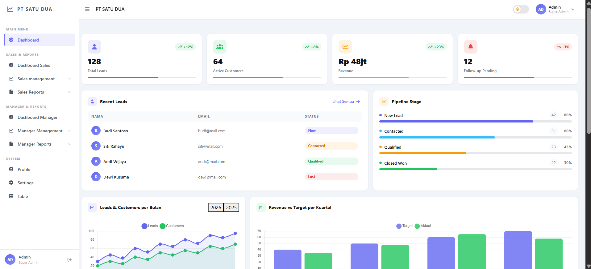

# TEMPLATE-VUE

Modern Open Source Vue Admin Template built with CoreUI + Vite.



---

## Overview

TEMPLATE-VUE is a reusable admin dashboard template built using Vue 3 and CoreUI.

This project is designed to help developers quickly start building modern admin panels, dashboards, and management systems with a clean and scalable architecture.

---

## Features

- Vue 3
- Vite
- CoreUI Layout
- Vue Router
- Pinia Store
- Axios Service Layer
- Responsive Layout
- Reusable Components
- Modular Folder Structure
- Authentication Layout
- Dashboard Layout
- Open Source Ready

---

## Tech Stack

- Vue 3
- Vite
- CoreUI
- Vue Router
- Pinia
- Axios
- Bootstrap 5
- Font Awesome

---

## Installation

Clone the repository:

```bash
git clone https://github.com/yourusername/template-vue.git
```

Enter project folder:

```bash
cd template-vue
```

Install dependencies:

```bash
npm install
```

Run development server:

```bash
npm run dev
```

---

## Build Production

```bash
npm run build
```

---

## Project Structure

```bash
src/
├── assets/
├── components/
├── composables/
├── layouts/
├── router/
├── services/
├── stores/
├── views/
├── App.vue
├── main.js
└── style.css
```

---

## Routing Structure

This template separates the application into two main areas:

### Authentication Area

Used for guest/public pages such as login.

Example route:

```txt
/login
```

File structure:

```bash
views/
└── auth/
    └── LoginView.vue
```


---

### Application Area

Used for authenticated pages after login.

Example route:

```txt
/app/dashboard
```

File structure:

```bash
views/
└── dashboard/
    └── DashboardView.vue
```

Layout:

```bash
layouts/
└── DefaultLayout.vue
```

---

## Application Flow

```txt
/login
   │
   └── User Login
           │
           ▼
/app/dashboard
           │
           └── Main Application Area
```

---

## Example Router Configuration

```js
import { createRouter, createWebHistory } from 'vue-router'

import AuthLayout from '@/layouts/AuthLayout.vue'
import DefaultLayout from '@/layouts/DefaultLayout.vue'

const routes = [

  {
    path: '/',
    redirect: '/login',
  },

  // AUTH AREA
  {
    path: '/',
    component: AuthLayout,
    children: [
      {
        path: 'login',
        name: 'Login',
        component: () => import('@/views/auth/LoginView.vue'),
      },
    ],
  },

  // APP AREA
  {
    path: '/app',
    component: DefaultLayout,
    children: [
      {
        path: 'dashboard',
        name: 'Dashboard',
        component: () => import('@/views/dashboard/DashboardView.vue'),
      },
    ],
  },

]

const router = createRouter({
  history: createWebHistory(),
  routes,
})

export default router
```

---

## Recommended Folder Structure

```bash
src/
├── components/
│   ├── common/
│   ├── forms/
│   ├── tables/
│   └── ui/
│
├── views/
│   ├── auth/
│   ├── dashboard/
│   ├── users/
│   └── settings/
│
├── services/
│   ├── api.js
│   ├── auth.service.js
│   └── user.service.js
```

---

## Screenshots

### Login Page


---

### Dashboard


---

### Table Page


---

## Environment Variables

Create `.env` file:

```env
VITE_API_URL=http://localhost:8000/api
```

---

## Roadmap

- [ ] Dark Mode
- [ ] Dynamic Sidebar
- [ ] Reusable Data Table
- [ ] Authentication Guard
- [ ] Role Permission
- [ ] Notification System
- [ ] Multi Language
- [ ] Theme Customizer
- [ ] API Generator

---

## Contributing

Contributions are welcome.

Feel free to fork this repository and submit pull requests.

---

## License

MIT License

---

## Author


Developed and maintained by **Apregi Clavis**

- Instagram: [@kirey234](https://www.instagram.com/kirey234/)
- GitHub: [github.com/ApregiPrataYuda](https://github.com/ApregiPrataYuda)

Developed with Vue 3 + CoreUI.